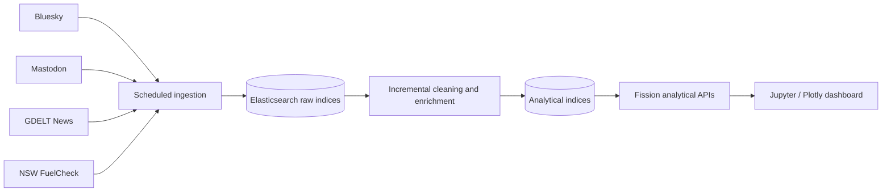

# Australian Fuel Price & Public Sentiment Analytics Platform

A cloud-native analytics project exploring how Australian fuel-price movements are discussed across social media and news media. The platform combines official NSW fuel-price data with Bluesky, Mastodon and GDELT data to compare discussion volume, sentiment, geographic patterns and recurring themes.

> This repository is a portfolio edition of a five-person University of Melbourne COMP90024 team project. It highlights the parts I contributed to and does not present the full team deliverable as individual work.

## Project overview

The project was designed around three questions:

1. How do fuel-price discussions differ across Bluesky, Mastodon and GDELT news?
2. How do discussion volume and sentiment vary across Australian locations?
3. Which broader themes appear alongside fuel prices, such as cost of living, taxation, transport and energy transition?

The team built an end-to-end pipeline that collected heterogeneous data, cleaned and enriched text, stored records in Elasticsearch, exposed analytical endpoints through Fission, and presented the results in an interactive notebook dashboard.

## Scale and outcomes

- Approximately **25.9 million Bluesky posts** and **11.6 million Mastodon posts** collected
- **347 Australian GDELT news articles** included in the news dataset
- Data covering approximately **January 2023 to May 2026**
- **18 topic-specific social-media harvesters** and **5 analytical API endpoints** in the full team system
- Cross-platform comparison of discussion volume, VADER sentiment and keyword themes

Selected findings from the team analysis:

- Aggregate sentiment was close to neutral on Bluesky (`0.028`) and Mastodon (`0.025`), while Mastodon showed a wider sentiment distribution.
- GDELT news was more positive on average (`0.266`) and more strongly framed around policy, tax and budget topics.
- Fuel-price discussions were linked with cost-of-living pressure, transport, government policy and electric-vehicle themes.

These are descriptive results. They should not be interpreted as causal evidence or as a representative measure of all Australian public opinion.

## Architecture



The full team platform ran on the NeCTAR Research Cloud using Kubernetes, Fission and Elasticsearch. Scheduled functions collected new records, while watermark-based processing avoided rescanning the complete raw dataset on every run. Stable document IDs supported deduplication and idempotent indexing.

## My contributions

My documented responsibilities in the team project were:

- Co-developed the **GDELT news** and **NSW FuelCheck** ingestion pipelines
- Contributed to **Elasticsearch index design and query implementation**
- Contributed to shared **data cleaning and VADER sentiment-analysis** workflows
- Participated in report writing, documentation and project presentation

Other team members led the Bluesky and Mastodon harvesters, REST API design, Kubernetes cluster administration, notebook dashboard and integration testing. See [CONTRIBUTIONS.md](CONTRIBUTIONS.md) for the complete attribution.

## Repository contents

```text
backend/
  ingestion/
    gdelt/              Australian news collection and deduplication
    nsw_fuel/           Daily official fuel-price ingestion and aggregation
  processing/
    news/               Incremental news cleaning and sentiment scoring
    social_media/       Shared social-media cleaning and enrichment
database/
  mappings.json         Elasticsearch mappings
  setup_elasticsearch.py
tests/
  test_api.py           Endpoint integration checks from the team system
```

This portfolio edition focuses on the data components relevant to my contribution. It intentionally excludes raw datasets, credentials, student IDs, the submitted course report and deployment-specific configuration.

## Data processing

### GDELT news

The news pipeline:

1. Queries fuel-price-related news terms
2. Filters for Australian sources or Australian locations in article titles
3. Removes duplicate URLs and normalized titles
4. Extracts article content and writes structured documents to Elasticsearch

### NSW FuelCheck

The official-price pipeline:

1. Authenticates with the NSW FuelCheck API
2. Retains U91, E10 and Diesel records
3. Groups station-level observations by date and fuel type
4. Calculates a daily average price and writes records with deterministic IDs

### Text enrichment

The processing functions normalize dates and platforms, remove common text noise, apply relevance filters, infer approximate location labels, and calculate VADER compound sentiment scores. A watermark records the latest processed timestamp for incremental execution.

## Technology stack

- Python, Pandas and Requests
- Elasticsearch and `elasticsearch-py`
- VADER sentiment analysis
- GDELT and NSW FuelCheck APIs
- Kubernetes and Fission in the full team deployment
- Jupyter, Plotly, Matplotlib, ipywidgets and WordCloud in the full dashboard

## Configuration

No credentials are committed to this repository. Copy the example configuration and provide values through environment variables or mounted Kubernetes secrets:

```bash
cp .env.example .env
```

Required values depend on the component being run. The NSW ingestion pipeline requires NSW API credentials and Elasticsearch access; the GDELT pipeline requires Elasticsearch access.

## Limitations

- VADER is fast and interpretable but performs poorly on sarcasm and context-dependent language.
- Social-media location inference is approximate because many records have incomplete or ambiguous location metadata.
- NSW FuelCheck provides an official price reference for NSW, not a complete national fuel-price dataset.
- Platform populations differ, so cross-platform results are descriptive rather than nationally representative.
- No model accuracy, API latency or throughput benchmark was established; this repository does not claim those metrics.

## Acknowledgements

Created by COMP90024 Team 39 at the University of Melbourne: Jinglei Zhang, Yun Gu, Yuanduan Zhu, Kehong Jiao and Xiaonan Wang.

Before reuse or redistribution, please contact the project contributors. No open-source licence is granted by this portfolio repository.


> Note: The published portfolio edition places the selected scripts at the repository root with descriptive filenames so each component can be reviewed directly.
